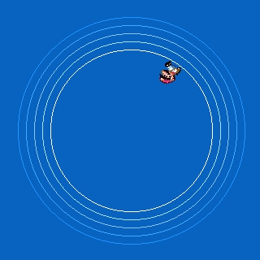



## Direct3D \-\> 2D

### Description

This program shows you how to use Direct3D to extend 2D games/programs. It uses no lighting or matrices or other more advanced Direct3D stuff, just shows you how to use rotation. Very basic, but allows you to do more then DirectDraw (or at least faster). Just hope someone could use this. Don't forget to leave comments (and vote)!
 
### More Info
 

             |
---                |---
**Submitted On**   |2001-02-25 13:58:04
**By**             |[Mark van Renswoude](https://github.com/Planet-Source-Code/PSCIndex/blob/master/ByAuthor/mark-van-renswoude.md)
**Level**          |Intermediate
**User Rating**    |4.7 (52 globes from 11 users)
**Compatibility**  |VB 4\.0 \(32\-bit\), VB 5\.0, VB 6\.0
**Category**       |[DirectX](https://github.com/Planet-Source-Code/PSCIndex/blob/master/ByCategory/directx__1-44.md)
**World**          |[Visual Basic](https://github.com/Planet-Source-Code/PSCIndex/blob/master/ByWorld/visual-basic.md)
**Archive File**   |[CODE\_UPLOAD154912252001\.zip](https://github.com/Planet-Source-Code/mark-van-renswoude-direct3d-2d__1-21337/archive/master.zip)

